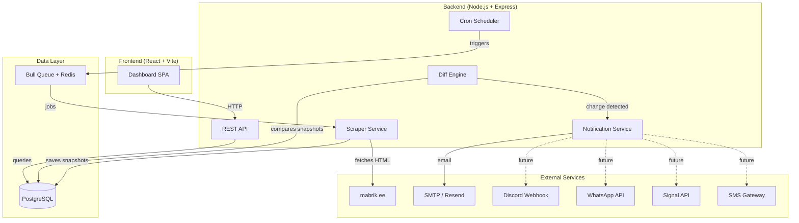
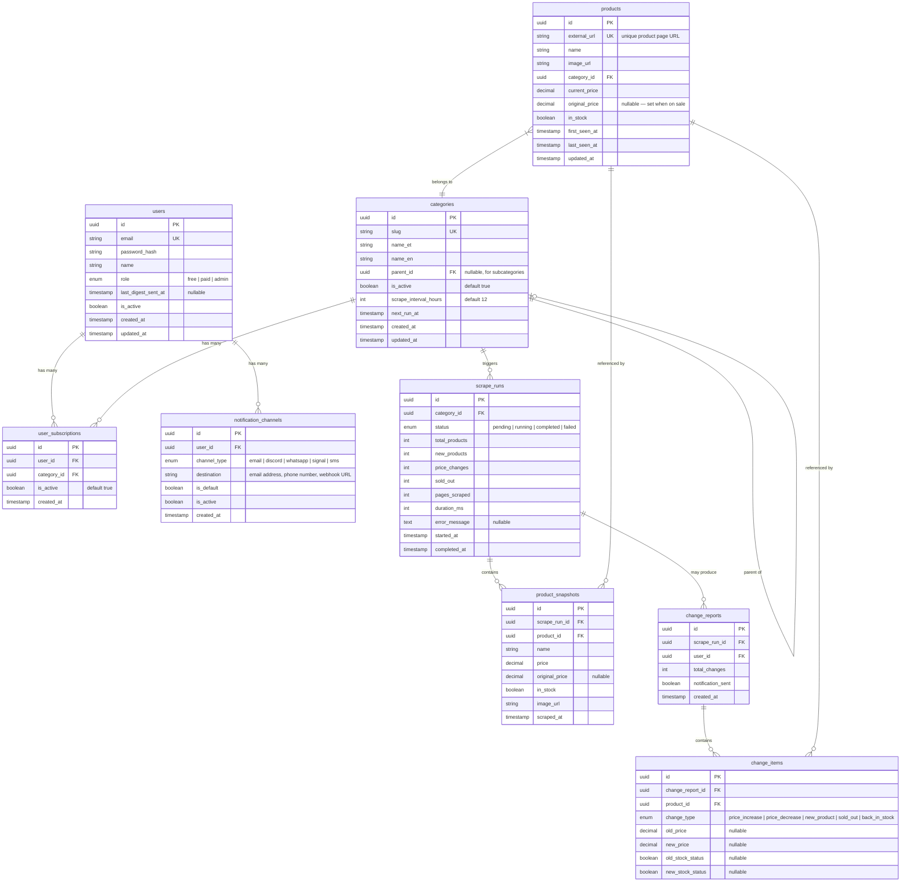

# Mabrik.ee Product Scraper & Dashboard — PRD

## 1. Overview

**Mabrik.ee** is an Estonian online store specializing in board games, card games, miniatures, Funko collectibles, hobby supplies, and fan merchandise. This project builds a **price-monitoring system** that periodically scrapes product data from mabrik.ee, detects changes (price drops/increases, new arrivals, sold-out items), and notifies users through configurable channels. A companion **web dashboard** lets users view scraped data, browse price history, and manage notification preferences.

---

## 2. Target Website Analysis

| Attribute | Detail |
|---|---|
| **Platform** | WordPress + WooCommerce |
| **Base URL** | `https://mabrik.ee` |
| **Category URL pattern** | `/tootekategooria/{category-slug}/` |
| **Pagination** | `/page/{n}/` (up to ~106 pages per category) |
| **Product count** | ~7,000+ across all categories |

### Product Categories Available for Scraping

| Category (Estonian) | English Translation | Slug | Products |
|---|---|---|---|
| Eeltellimused | Pre-orders | `eeltellimused` | — |
| Lauamängud | Board Games | `lauamangud` | ~1,269 |
| Kodu ja kollektsioon | Home & Collectibles | `kodu-ja-kollektsioon` | ~992 |
| Funko tooted | Funko Products | `funko` | ~468 |
| Miniatuurimängud | Miniature Games | `miniatuurid` | ~497 |
| Riided ja aksessuaarid | Clothing & Accessories | `riided-ja-aksessuaarid` | ~237 |
| Värvid ja hobitooted | Paints & Hobby Supplies | `varvid-ja-hobitooted` | ~1,071 |
| Rollimängud | Role-Playing Games | `rollimangud` | ~519 |
| Kaardimängud | Card Games | `kaardimangud` | ~511 |
| Raamatud ja koomiksid | Books & Comics | `raamatud-ja-koomiksid` | ~966 |
| Figuurid ja mänguasjad | Figures & Toys | `kodu-ja-kollektsioon/figuurid-ja-manguasjad` | ~410 |
| Lõpumüük | Clearance Sale | `lopumuuk` | ~876 |

### Data Points Scraped Per Product

- **Name** — product title
- **Price** — current price in EUR (including sale price if applicable)
- **Original price** — if on sale, the crossed-out original price
- **Image URL** — primary product image
- **Product URL** — direct link to the product page
- **Stock status** — in stock / out of stock
- **Category** — which category/subcategory it belongs to

---

## 3. System Architecture

---

## 4. Tech Stack

### 4.1 Backend

| Technology | Purpose | Why This Choice |
|---|---|---|
| **Node.js 20 LTS** | Runtime | Non-blocking I/O is ideal for high-concurrency HTTP scraping; single language across the stack (TypeScript) |
| **Express.js** | HTTP server / REST API | Lightweight, well-documented, huge middleware ecosystem |
| **TypeScript** | Language | Type safety reduces bugs in complex scraper logic and data transformations |
| **Cheerio** | HTML parser | jQuery-like API for server-side DOM traversal; fast, lightweight — ideal for parsing WooCommerce product pages without a full browser |
| **Axios** | HTTP client | Promise-based, supports interceptors for retry logic, rate-limiting headers, and proxy rotation |
| **node-cron** | Scheduling | Lightweight in-process cron scheduler for triggering scrape jobs on user-defined intervals |
| **Bull + Redis** | Job queue | Reliable job queue with retries, concurrency control, and progress tracking; prevents overloading the target site |
| **PostgreSQL 16** | Database | ACID compliance, JSONB support for flexible product metadata, excellent for time-series-like price history queries |
| **Prisma** | ORM | Type-safe database client auto-generated from schema; great migration tooling; integrates naturally with TypeScript |
| **Nodemailer / Resend** | Email delivery | Nodemailer for SMTP in development; Resend for production transactional emails with high deliverability |
| **bcrypt + JWT** | Authentication | Industry-standard password hashing and stateless auth tokens |
| **Zod** | Validation | Runtime schema validation for API inputs and scraped data integrity |

#### How the Scraper Works

1. **Scheduler** fires a cron job (default: every 12 hours) for categories that have active subscribers.
2. The job is placed on a **Bull queue** (backed by Redis) to control concurrency and retries.
3. The **Scraper worker** picks up the job, iterates through the category pages:
   - Fetches each page with Axios (with 1–2s random delays between requests to be respectful).
   - Parses the HTML with Cheerio to extract product name, price, image, URL, and stock status.
   - Handles pagination by following "next page" links until all pages are scraped.
4. **State-based Snapshot saving**: The scraper compares the newly fetched data against the latest known `product` record in the database.
   - If **NO change** is detected (price and stock remain identical), it **does not** create a new `product_snapshot`. It simply updates the `last_seen_at` timestamp on the `products` table.
   - If **A change** is detected (e.g., price drop, stock status change), it updates the `products` table and inserts a new `product_snapshot` into the database.
5. The **Diff Engine** builds a comprehensive summary of changes for that category run:
   - **Price changes**: products whose price differs.
   - **New products**: products discovered for the first time.
   - **Sold out**: products present in the previous snapshot marked as in-stock, now either absent or marked out-of-stock.
   - **Back in stock**: products previously marked as out-of-stock, now available again.
6. If changes are detected, a **change report** is persisted and the **Notification Service** is triggered.
7. The Notification Service queries all users subscribed to that category:
   - **Paid Users**: The service immediately compiles an email (or future channel) with a summary of the changes and sends it to each Paid user.
   - **Free Users**: Changes are recorded but no immediate email is sent. Instead, a separate "Digest Cron" runs every 6 hours, aggregates all changes since the user's `last_digest_sent_at`, and sends a single compiled summary email.

---

### 4.2 Frontend

| Technology | Purpose | Why This Choice |
|---|---|---|
| **React 18** | UI framework | Component-based, rich ecosystem, your existing strength (from past projects) |
| **Vite** | Build tool | Instant HMR, fast builds; already scaffolded in this project |
| **TypeScript** | Language | Shared types with the backend; safer props/state management |
| **React Router v6** | Routing | Declarative routing for dashboard views |
| **TanStack Query** | Data fetching | Automatic caching, background refetching, loading/error states for API calls |
| **Recharts** | Charts | Lightweight React charting library for price history graphs |
| **React Hook Form + Zod** | Forms & validation | Performant form handling with schema validation (shared Zod schemas with backend) |
| **CSS Modules** | Styling | Scoped styles, no naming conflicts, no extra dependencies |

#### Dashboard Pages

| Page | Description |
|---|---|
| **Login / Register** | Auth with email + password |
| **Dashboard Home** | Latest scrape summary: total products tracked, recent changes at a glance |
| **Scrape History** | Paginated list of past scrapes with timestamp, category, products found, and changes detected |
| **Scrape Detail** | Full product list from a specific scrape; diff view highlighting price changes, new items, sold-out items |
| **Price History** | Per-product price chart over time |
| **Settings** | Configure scrape interval, notification channels, target categories, and email address |

---

### 4.3 User Roles & Permissions

The system implements a tiered role system to manage resource utilization and provide premium value.

| Role | Category Tracking Limit | Notification Interval | Description |
|---|---|---|---|
| **Free** | Max 3 categories | 6-Hour Digest | Entry-level tier. Users select up to 3 categories. The diff engine aggregates all changes and sends a single summary email every 6 hours based on their `last_digest_sent_at`. |
| **Paid** | Max 6 categories | Immediate | Premium tier. Users receive immediate email notifications the moment a scrape finishes if a change is detected. |
| **Admin** | Unlimited | Immediate | Superuser tier. Can track unlimited categories and has access to system management APIs (e.g., manually triggering category refreshes). |

---

## 5. Database Design

### 5.1 Entity Relationship Diagram

### 5.2 Table Descriptions

#### `users`
Stores registered users. Each user can create multiple subscriptions and notification channels depending on their `role` (free, paid, or admin). The email is unique and doubles as the default notification destination. The `last_digest_sent_at` timestamp is used exclusively for Free users to track when their 6-hour scheduled summary email was last dispatched.

#### `categories`
Defines **what** to scrape and **how often**. This maps directly to Mabrik.ee's navigation tree. It supports subcategories via `parent_id`. `next_run_at` is recalculated after every run so the scheduler knows which jobs to fire next. We only scrape a category if it has at least one active subscriber.

#### `user_subscriptions`
Maps a user to a category they want to follow. Multiple users can subscribe to the same category, meaning we only scrape it once.

#### `categories` → `scrape_runs` (one-to-many)
Every time a scrape job fires for a category, a `scrape_run` is created to track execution status, timing, and high-level stats.

#### `products`
A **canonical product registry** — a deduplicated record of every product ever seen. Keyed by `external_url` (the mabrik.ee product page link) to prevent duplicates. Linked to `category_id`. `current_price` and `in_stock` reflect the latest known state.

#### `product_snapshots`
A **point-in-time record** of a product's data during a specific scrape run. This table powers the price history charts. Because we use **state-based snapshots**, a new row is ONLY created here when a product's price or stock status actually changes. By querying all snapshots for a `product_id`, ordered by `scraped_at`, we build the price timeline.

#### `change_reports` & `change_items`
When the diff engine detects differences between two consecutive scrape runs for a category, it creates a `change_report` with individual `change_items`. Each item records the type of change (`price_increase`, `price_decrease`, `new_product`, `sold_out`, `back_in_stock`) and the before/after values. The Notifier then dispatches alerts to all users subscribed to that category.

#### `notification_channels`
Extensible notification configuration. On day one, only `email` is active. Future channels (Discord, WhatsApp, Signal, SMS) are added as new rows with their respective `channel_type` and `destination` (webhook URL, phone number, etc.). The `is_default` flag marks the primary channel per user.

### 5.4 Edge Case: Sold Out & Restocks
If a product goes out of stock and disappears from the category page entirely:
1. The Diff Engine notices the product is missing from the scrape but exists in the DB as `in_stock = true`.
2. It generates a `sold_out` change event and marks the `products` table record as `in_stock = false`.
3. If the product is restocked weeks later under the same URL, the scraper identifies it via its `external_url` (the canonical unique key). It does NOT create a duplicate product. Instead, it flips `in_stock` back to `true`, saves a new snapshot, and emits a `back_in_stock` change event.

### 5.5 Key Relationships

| Relationship | Type | Description |
|---|---|---|
| `users` → `user_subscriptions` | 1:N | A user can track multiple categories |
| `categories` → `user_subscriptions` | 1:N | A category can have many subscribers |
| `categories` → `scrape_runs` | 1:N | Each category produces many runs over time |
| `scrape_runs` → `product_snapshots` | 1:N | A run captures a snapshot of every product found |
| `products` → `product_snapshots` | 1:N | A product appears in many snapshots over time |
| `categories` → `products` | 1:N | A product belongs to a category |
| `scrape_runs` → `change_reports` | 1:0..1 | A run may produce at most one change report per user |
| `change_reports` → `change_items` | 1:N | A report lists all individual changes |
| `users` → `notification_channels` | 1:N | A user can have multiple notification destinations |

---

## 6. API Endpoints (v1)

### Authentication
| Method | Endpoint | Description |
|---|---|---|
| `POST` | `/api/auth/register` | Register new user |
| `POST` | `/api/auth/login` | Login, returns JWT |
| `POST` | `/api/auth/logout` | Invalidate token |
| `GET` | `/api/auth/me` | Get current user profile |

### Categories & Subscriptions
| Method | Endpoint | Description |
|---|---|---|
| `GET` | `/api/categories` | List available mabrik.ee categories (hierarchical) |
| `GET` | `/api/subscriptions` | List user's active category subscriptions |
| `POST` | `/api/subscriptions` | Subscribe to a category |
| `DELETE` | `/api/subscriptions/:id` | Cancel a subscription |

### Scrape Runs & Data
| Method | Endpoint | Description |
|---|---|---|
| `GET` | `/api/runs` | List scrape runs (paginated, filterable) |
| `GET` | `/api/runs/:id` | Get run details + stats |
| `GET` | `/api/runs/:id/products` | Get product snapshots from a run |
| `GET` | `/api/runs/:id/changes` | Get change report for a run |
| `POST` | `/api/runs/trigger` | Manually trigger a scrape |

### Products & Price History
| Method | Endpoint | Description |
|---|---|---|
| `GET` | `/api/products` | Search/browse all products |
| `GET` | `/api/products/:id` | Get product details |
| `GET` | `/api/products/:id/history` | Get price history for a product |

### Notification Settings
| Method | Endpoint | Description |
|---|---|---|
| `GET` | `/api/notifications/channels` | List user's notification channels |
| `POST` | `/api/notifications/channels` | Add a channel |
| `PATCH` | `/api/notifications/channels/:id` | Update channel settings |
| `DELETE` | `/api/notifications/channels/:id` | Remove a channel |

### System Operations
| Method | Endpoint | Description |
|---|---|---|
| `POST` | `/api/system/refresh-categories` | Scrape mabrik.ee nav menu to update categories DB (admin) |

---

## 7. Development Roadmap

### Phase 1 — Foundation (Weeks 1–2)

> **Goal**: Project scaffolding, database, auth, and basic scraper.

- [x] Initialize monorepo structure (`/backend`, `/frontend`, `/shared`) ✅ *2025-02-25*
- [ ] Set up backend: Express + TypeScript + Prisma
- [ ] Set up PostgreSQL database + Prisma schema + migrations
- [ ] Implement user registration and login (bcrypt + JWT)
- [ ] Build basic scraper module:
  - Fetch a single category page
  - Parse products with Cheerio
  - Handle pagination
  - Save to `products` and `product_snapshots`
- [ ] Seed the `categories` reference data

### Phase 2 — Diff Engine & Email Notifications (Weeks 3–4)

> **Goal**: Detect changes and send email alerts.

- [ ] Implement diff engine: compare latest snapshot to previous
- [ ] Generate `change_reports` and `change_items`
- [ ] Create email templates (HTML) for change summaries
- [ ] Integrate Nodemailer (dev) / Resend (prod) for email delivery
- [ ] Set up Bull queue + Redis for job management
- [ ] Implement `node-cron` scheduler that enqueues jobs based on `categories.next_run_at`
- [ ] Build the `notification_channels` CRUD API

### Phase 3 — Dashboard: Core Views (Weeks 5–7)

> **Goal**: Frontend dashboard with auth, scrape history, and product views.

- [ ] Scaffold React + Vite frontend with TypeScript
- [ ] Implement auth pages (login, register) with React Hook Form
- [ ] Build dashboard home page (latest scrape stats)
- [ ] Build scrape history page (paginated table)
- [ ] Build scrape detail page (product list + diff highlighting)
- [ ] Build product price history page with Recharts
- [ ] Set up TanStack Query for all API calls

### Phase 4 — Dashboard: Settings & Configuration (Week 8)

> **Goal**: User settings for scrape interval, categories, and notifications.

- [ ] Build settings page:
  - Scrape interval selector (dropdown: 6h, 12h, 24h, 48h)
  - Category multi-select (which categories to track)
  - Email notification configuration (change destination email)
- [ ] Wire settings to backend CRUD APIs
- [ ] Manual "scrape now" button with progress indicator

### Phase 5 — Polish & Production Readiness (Weeks 9–10)

> **Goal**: Error handling, rate limiting, monitoring, and deployment.

- [ ] Add rate limiting to API endpoints
- [ ] Add scraper politeness features (respect `robots.txt`, adaptive delays)
- [ ] Implement error handling and retry logic for failed scrapes
- [ ] Add logging (Winston or Pino)
- [ ] Dockerize backend + frontend + PostgreSQL + Redis
- [ ] Write `docker-compose.yml` for local development
- [ ] Set up CI/CD pipeline
- [ ] Deploy to VPS or cloud platform

### Phase 6 — Additional Notification Channels (Future)

> **Goal**: Extend notifications beyond email.

- [ ] Discord webhook integration
- [ ] WhatsApp Business API integration
- [ ] Signal API integration
- [ ] SMS gateway integration (e.g., Twilio)
- [ ] Per-channel notification preferences in dashboard

---

## 8. Non-Functional Requirements

| Requirement | Detail |
|---|---|
| **Rate limiting** | Max 1 request/second to mabrik.ee; random 1–2s delay between pages |
| **Retry logic** | 3 retries with exponential backoff on failed page fetches |
| **Data retention** | Keep all historical snapshots (configurable purge after N months in future) |
| **Security** | Passwords hashed with bcrypt (12 rounds); JWT tokens with 7d expiry; HTTPS only in production |
| **Scalability** | Bull queue enables horizontal scaling of scraper workers independently |
| **Monitoring** | Health check endpoint; scrape run status tracking; failed job alerts |

---

## 9. Risks & Mitigations

| Risk | Impact | Mitigation |
|---|---|---|
| mabrik.ee changes HTML structure | Scraper breaks | Use resilient selectors; add scrape validation step; alert on parse failures |
| Rate limiting / IP blocking by mabrik.ee | Scraping stops | Respect `robots.txt`; add delays; use proxy rotation if needed |
| Large product catalogs cause slow scrapes | Timeouts | Paginate processing; use Bull queue with timeouts; scrape categories in parallel |
| Email deliverability issues | Users miss notifications | Use Resend (dedicated email API); monitor bounce rates; add SPF/DKIM records |

---

## 10. Deployment Strategy

### Recommended Stack (Starting Out)

| Component | Service | Est. Cost |
|---|---|---|
| **PostgreSQL** | [Neon](https://neon.tech) (managed Postgres) | Free tier → ~$25/mo |
| **Backend + Redis** | [Hetzner](https://hetzner.com) VPS (Helsinki DC) | ~€4.50/mo |
| **Frontend** | [Vercel](https://vercel.com) | Free |

**Total starting cost: under €5/month.**

**Why this combination:**
- **Neon** provides managed PostgreSQL with automatic backups, scaling, and a generous free tier — you just swap in a connection string
- **Hetzner Helsinki** offers low latency from Estonia, excellent price-to-performance, and enough power to run the backend + Redis in Docker
- **Vercel** hosts the React SPA for free with global CDN, automatic deploys from Git, and zero configuration

### Alternative Deployment Options

#### All-in-One VPS (Most affordable)
Run everything (backend, PostgreSQL, Redis, frontend via Nginx) on a single Hetzner/DigitalOcean VPS for ~€6–12/mo. Use `docker-compose.yml` as-is, with Nginx as reverse proxy and `certbot` for SSL. Set up `pg_dump` cron jobs for database backups.

#### Cloud Platform (Most scalable)
For growth: AWS RDS or Google Cloud SQL for Postgres (~$15–30/mo), Cloud Run or ECS for the backend (~$10–25/mo), Upstash for Redis (free → $10/mo), and Vercel for the frontend.

### Migration Process (Local → Production)

1. **Provision production database** — create a Neon project, get the connection string
2. **Update environment variables** — set `DATABASE_URL` to the production connection string
3. **Run migrations** — `npx prisma migrate deploy` applies all migrations to the production DB
4. **Seed reference data** — insert category data
5. **Deploy backend** — push Docker image to the VPS via SSH or CI/CD pipeline
6. **Deploy frontend** — connect Vercel to the Git repo; it auto-deploys on push
7. **Configure DNS + SSL** — point your domain to the VPS; use `certbot` or Cloudflare for HTTPS

No application code changes needed — only environment variables change between local and production.
